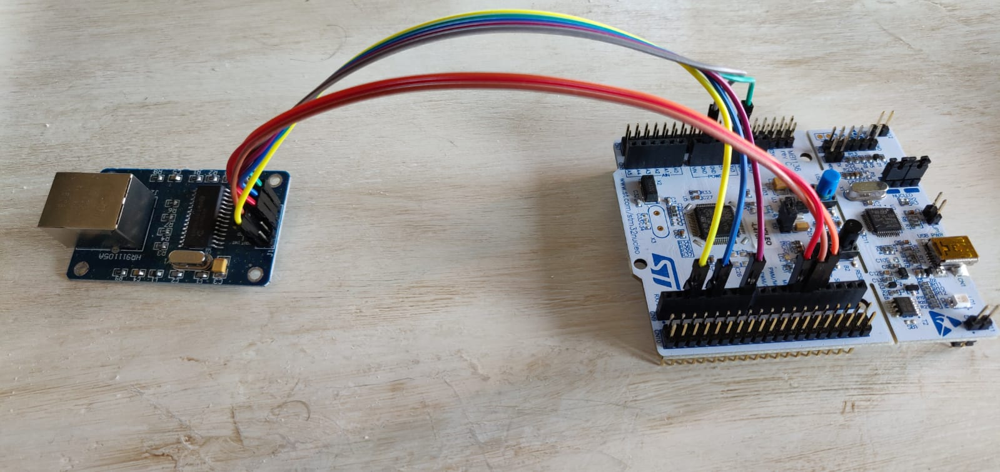

#### Test 01

I want to show how an external transceiver can be easily connected to
Nucleo-64 board. Hardware components

1. Transciever: [ENC28J68](http://ww1.microchip.com/downloads/en/DeviceDoc/39662e.pdf)
2. Mcu: [STM32L476RG](https://www.st.com/en/microcontrollers-microprocessors/stm32l476rg.html)

ENC28J68 is stand-alone ethernet controller with SPI Interface, it integrates a
MAC and 10Base-T PHY and supports Full and Half-Duplex modes. It's fully
Compatible with 10/100/1000Base-T Networks

Riot-os includes the kernel support of the stm32 mcu and the driver of the
external transceiver:

1. Makefile.hw.setup: which describes pins connection between the arduino-connectors'
   Nucleo-64 board and the breakout board of transceiver.
2. Makfile: which includes the minimal networking device support (`gnrc_netdev_default`
   and `auto_init_gnrc_netif`)
3. main.c: which contains few things: the ifconfig command is provided by minimal 
   networking support and shows only the MAC address because any IPV4/6 support has
   not been added. The state of the link is notified.



#### Example of output:
```
> main(): This is RIOT! (Version: 2020.01-devel-HEAD)
RIOT-OS, MCU=stm32l4 Board=nucleo-l476rg
> ifconfig
Iface  3  HWaddr: 3E:1A:46:14:1E:53  Link: up
          L2-PDU:1500 Source address length: 6

> help
Command              Description
---------------------------------------
reboot               Reboot the node
ps                   Prints information about running threads.
ifconfig             Configure network interfaces
> ifconfig
Iface  3  HWaddr: 3E:1A:46:14:1E:53  Link: down
          L2-PDU:1500 Source address length: 6

>
```
