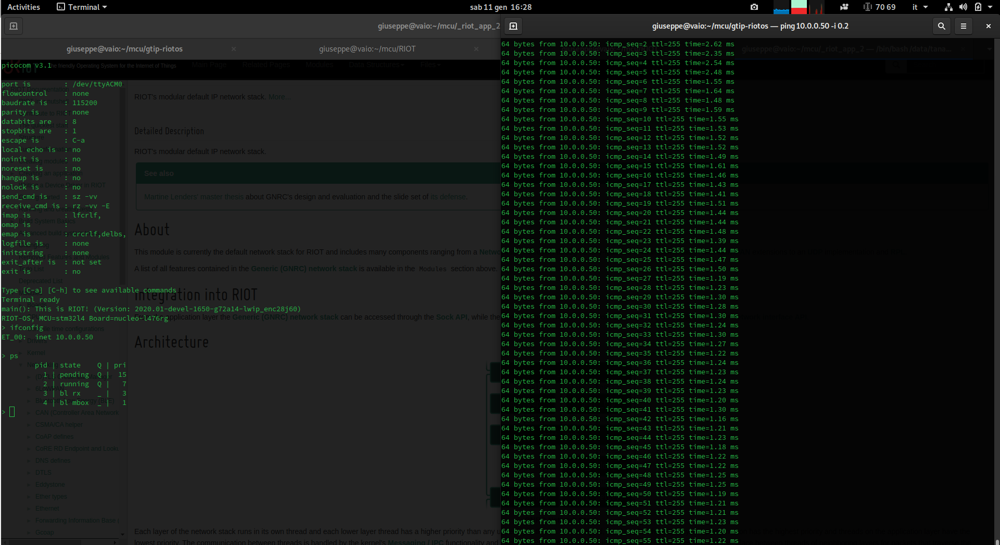

#### Test 02

I want to show how the lwIP - Lightweight TCP/IP stack can be easily setup with
Riot-OS. Hardware components

1. Transceiver: [ENC28J68](http://ww1.microchip.com/downloads/en/DeviceDoc/39662e.pdf)
2. Mcu: [STM32L476RG](https://www.st.com/en/microcontrollers-microprocessors/stm32l476rg.html)

Riot-os uses lwIP package to support the TCP/IP v4 while for IPv6 we can use
the [GNRC](https://doc.riot-os.org/group__net__gnrc.html) stack

1. Makefile.hw.setup: which describes pins connection between the arduino-connectors'
   Nucleo-64 board and the breakout board of transceiver.
2. Makefile.net.setup: which includes the networking support
3. Makfile: which includes the common project setup
4. main.c: it run only the shell.

#### Note:
The transceiver that I used is not supported by lwIP's auto-init yet. I opened a
[PULL-REQUEST](https://github.com/RIOT-OS/RIOT/pull/13092) to add this support to Riot-OS main-line.



#### Example of output:
```
main(): This is RIOT! (Version: 2020.01-devel-1650-g72a14-lwip_enc28j60)
RIOT-OS, MCU=stm32l4 Board=nucleo-l476rg
> ifconfig
ET_00:  inet 10.0.0.50

> ps
	pid | state    Q | pri
	  1 | pending  Q |  15
	  2 | running  Q |   7
	  3 | bl rx    _ |   3
	  4 | bl mbox  _ |   1
>
```
