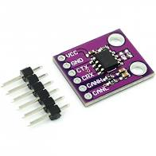
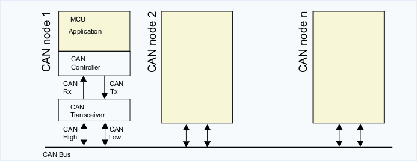

#### Test 04

With test 04 I will use the STM32's bxCAN (Basic Extended CAN peripheral) with
an external CAN transceiver.
I've two Nucleo-64 board with STM32L476RG MCU, my goal is to send CAN frames
from the first board to the second one and vice versa.

The nucleo-64 boards need an external transceiver,  each CAN node is
composed by two-part, the CAN controller (it's embedded into my Nucleo-64
Board) and an external transceiver. I used a [MCP2551](https://www.microchip.com/wwwproducts/en/en010405) is easy to find a
breakout board like this:



The breakout board used by MCP2551 uses a 4.7KΩ resistor between its RS pin and
ground. This force the IC to operate in SLOPE-CONTROL mode, where the slew rate
(SR) is proportional to the current ouput at the the RS pin.

Global view of the mcu and transceiver:



Riot-os for the STM32 family target includes the [perih_can](https://github.com/RIOT-OS/RIOT/blob/master/cpu/stm32_common/periph/can.c) but it's missing of support
for my board (my CPU) I opened a [PR](https://github.com/RIOT-OS/RIOT/pull/13534) that adds the CAN support to STM32L4 cpu family.

To test the final system I useded the the userspace test tool [conn_can](https://github.com/RIOT-OS/RIOT/tree/master/tests/conn_can)


#### Nucleo-64 (1):

I set the board to dump the CAN traffic with specifc ID by cmd `can dump `

```
> reboot
0: launching receive_thread
1: launching receive_thread
RIOT-OS, MCU=stm32l4 Board=nucleo-l476rg
> ps
	pid | state    Q | pri 
	  1 | pending  Q |  15
	  2 | running  Q |   7
	  3 | bl rx    _ |   5
	  4 | bl rx    _ |   4
	  5 | bl mutex _ |   8
	  6 | bl rx    _ |   6
	  7 | bl rx    _ |   6
> test_can send 0 0 1 2 34 44 55 66
Error when trying to send
> can dump ifnum 0 nb 0 ms 100 0
can_stm32_0(0)        0  [6]  01 02 34 44 55 66
can_stm32_0(0)        0  [6]  01 02 34 44 22 00
can_stm32_0(0)        0  [6]  01 02 34 44 55 22
```

#### Nucleo-64 (2):

By the cmd `test_can send` I sent a message on the CAN 
```
0: launching receive_thread
1: launching receive_thread
RIOT-OS, MCU=stm32l4 Board=nucleo-l476rg
> test_can send 0 0 1 2 34 44 55 66
> test_can send 0 0 1 2 34 44 22 0
> test_can send 0 0 1 2 34 44 55 22
```

#### Host:
The CAN interface by host side can be configured:
1. Using a supported Linux CAN device
```
# Find your interface name (e.g. can0)
ip link
# Configure bitrate
sudo ip link set can0 type can bitrate 1000000
# Bring the device up
sudo ip link set can0 up
# Optionally configure CAN termination
sudo ip link set can0 type can termination 1
```
2. Using slcand, we can configuring a CAN over Serial device.
```
# Create SocketCAN device from serial interface
sudo slcand -o -c -s8 -S1000000 /dev/ttyUSB0 can0
# Bring the device up
sudo ip link set can0 up
```
3. Using builtin Linux kernel virtual CAN module vcan
```
sudo modprobe vcan
sudo ip link add dev can0 type vcan
sudo ip link set can0 up
```

I bought a cheap [USB-CAN](https://www.amazon.it/gp/product/B07P7G4R8H/ref=ppx_od_dt_b_asin_image_s00?ie=UTF8&psc=1) adapter, my product uses slcand.
We have to configure the peripherical, therefore I wrote a little script bash [candev](./script/candev.sh)
