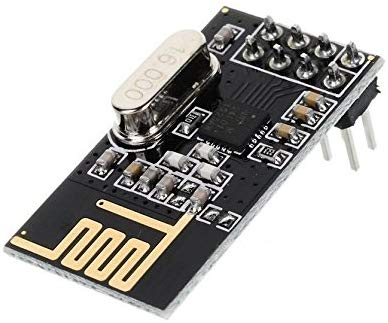

#### Wireless Transciever

In this example, I want to interface my Nucleo-64 board to 2.4GHz Wireless
transceiver. I looked for one transceiver widely used and cheap.

I find with the [nfr24l01p](./media/nRF24L01.pdf) a perfect match, riot-os supports it in a low-level
way but there's a [PR](https://github.com/RIOT-OS/RIOT/pull/12681) to add it to GNRC (generic network stack) and this is a
great thing.

Thanks to GNR we can use many cool feature of RioT OS

I bought a breakout board of that chip, it comes with 8 pin header and a
built-in printed antenna on PBC:

1. NRF24L01 transceiver module. It uses the 2.4GHz ISM band and it can
   operate with baud rates from 250 kbps up to 2 Mbps, GFSK modulation
2. The printed antenna reaches up to 100m in open space (with 250Kbps)
3. Radio has 6 pipe so it's able to communicate with up to 6 other devices
   in the same time.
4. Its PA (Power Amplifier) has four programmable power steps: [-18,-12,-6,0]dbm
5. The RX sensitivity is 94dBm at 250kbps
6. 1.9 to 3.6V supply range, it needs up to 13.5mA at 2Mbps in RX mode.

WIP
